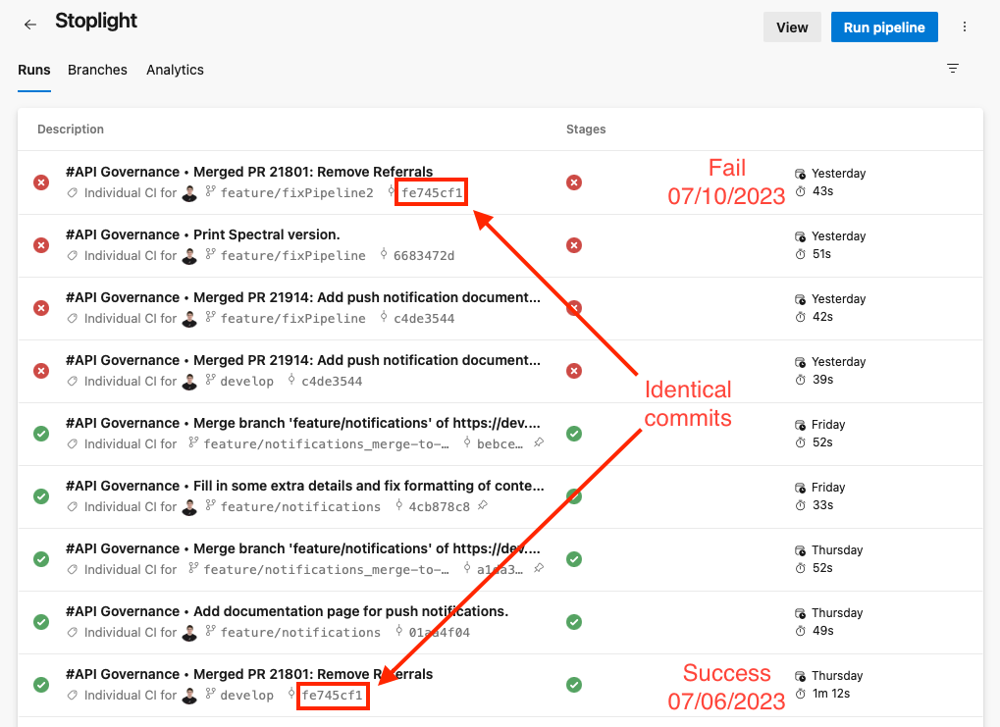

# spectral-rule-override-bug

This project demonstrates a recent bug that was introduced to Spectral where rule overrides are not being honored.

## Steps to Reproduce

1. Install spectral on your machine using [npm](https://www.npmjs.com):

```Shell
npm install -g @stoplight/spectral-cli
```

**NOTE:** This issue only manifests after a fresh Spectral installation. Make sure to remove Spectral first if it's already installed:

```Shell
npm uninstall -g @stoplight/spectral-cli
npm install -g @stoplight/spectral-cli
```

At the time of initial publishing, Spectral version `6.8.0` was installed.

2. Clone this repository and `cd` into it:

```Shell
git clone https://github.com/br-tyler-milner/spectral-rule-override-bug.git
cd spectral-rule-override-bug
```

3. Run Spectral against the OpenAPI specification:

```Shell
spectral lint ./reference/*.yaml --ruleset .spectral.yaml --verbose
```

4. Notice that linter warnings/errors are output:

```Shell
 12:26    error  path-casing            Paths must be kebab-case                   paths./v2.1/users/{userId}
 12:26  warning  resource-names-plural  Resource names should generally be plural  paths./v2.1/users/{userId}
```

However, there should **not** be output due to the rule overrides defined in [.spectral.yaml](./.spectral.yaml), which turn off these rules for the endpoint:

```yaml
# Rule overrides
overrides:
  - files:
      - "reference/Demo.yaml#/paths/~1v2.1~1users~1{userId}"
      - "reference/Demo.yaml#/paths/~1user"
    rules:
      resource-names-plural: "off"

  - files:
      - "reference/Demo.yaml#/paths/~1v2.1~1users~1{userId}"
    rules:
      path-casing: "off"
```

Notice that the `/v2.1/users/{userId}` path has both the `resource-names-plural` and `path-casing` rules turned **off**, yet Spectral is still flagging failures for these rules.

## Suspected Root Cause

Based on observing recent commit history to the spectral repository, it appears this issue may have been introduced in [this commit](https://github.com/stoplightio/spectral/commit/13bec9f9cf2cdff094666352e8e3c121f0517ab8) in which the `spectral-core` dependency was updated from version `1.18.1` to version `1.18.2`.

This observation is backed up by the fact that my build pipeline mysteriously started failing *after* that Spectral commit was pushed. While investigating, I kicked off another which produced a build failure despite having run on a commit identical to the passing build a few days prior:



In my pipeline, Spectral is locked to version `6.6.0`, however Spectral's `cli` [package.json](https://github.com/stoplightio/spectral/blob/develop/packages/cli/package.json) allows for the version of the `spectral-core` dependency to be auto-updated all the way to version `2.0.0` (non-inclusive):

```json
{
  "name": "@stoplight/spectral-cli",
  "dependencies": {
    "@stoplight/spectral-core": "^1.15.1",
  },
}
```

Furthermore, I was initially unable to reproduce this issue locally due to the fact that Spectral was already installed on my machine. After reinstalling spectral, I was able to reproduce the issue that my build pipeline was experiencing (Spectral is installed for each run of the build pipeline). This again points to one of Spectral's dependencies having been updated resulting in the updated (broken) version being used during a fresh Spectral installation.
